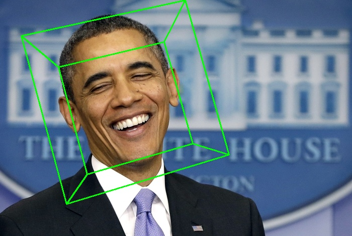

# head-pose-estimation

C++ implementation of realtime human head pose estimation using dlib and OpenCV. 





## How it works
There are 3 major steps:

1. face detection (dlib)
2. face landmarks extraction (dlib)
3. pose estimation using a generic 3D face (PnP solve)

This implementation is inspired from yinguobing's python implementation. (https://github.com/yinguobing/head-pose-estimation)


## how to run
You'll need to have OpenCV pre-installed in order to compile this project.

clone the repo and get download the models
```bash
git clone https://github.com/xavyding/head-pose-estimation.git
cd head-pose-estimation
git lfs pull
```

build the repo
```bash
mkdir build
cd build
cmake ..
make
```

if sucessful, there will be a "demo" executable. Run it on any image to estimate the pose !


## Authors
Xavier 'Yixin' Ding

